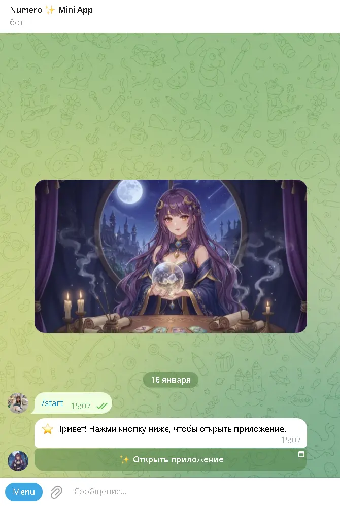
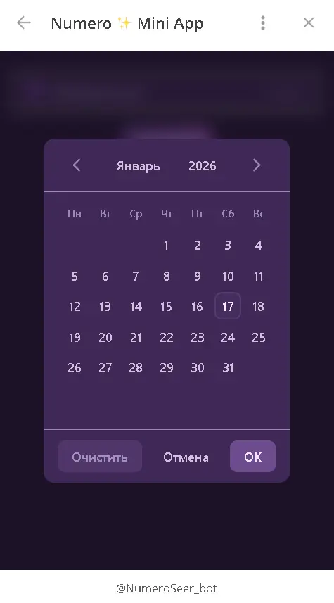
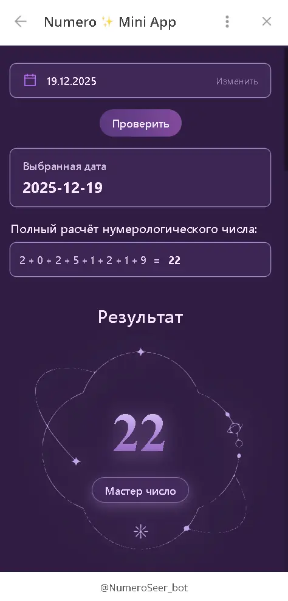
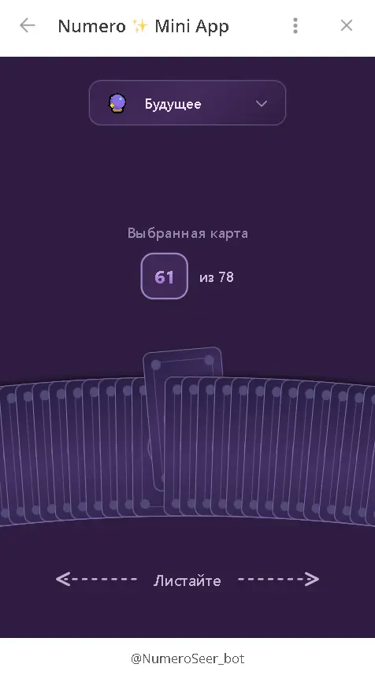
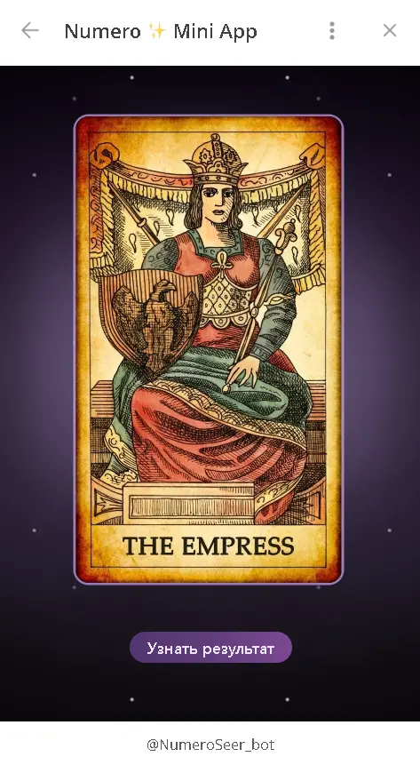
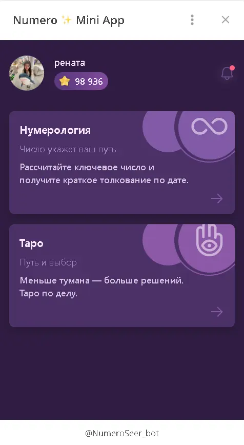

# 🔮 Numero TMA

Numero is a **Telegram mini-app** for **numerology calculations** and **tarot card predictions**.
Users can calculate their **Life Path Number** and receive **one-card tarot readings** across categories such as **love, money, health, yes/no, and future**.

Numerology results include **personality insights**, **recommendations**, and a list of **famous people** with the same number.

Users start with **free predictions** and can purchase additional credits via **Telegram Stars**.

## 🎬 Demo

**Live App**: Telegram Bot Name — @NumeroSeer_bot | [Telegram Bot Link](https://t.me/NumeroSeer_bot)

<p align="center">
  
  
  
</p>

<p align="center">
  
  
  
  
</p>

## ⚙ Tech Stack

### Frontend

- **Framework**: React 18
- **Language**: TypeScript
- **Build Tool**: Vite with SWC
- **Routing**: React Router (HashRouter)
- **State Management**: Zustand
- **Styling**: Tailwind CSS 4 + SCSS
- **UI Components**: Telegram UI (`@telegram-apps/telegram-ui`)
- **HTTP Client**: Axios
- **Testing**: Vitest + React Testing Library

### Backend

- **Runtime**: Node.js
- **Framework**: Express.js
- **Language**: TypeScript
- **Database**: PostgreSQL (via `pg`)
- **File Storage**: AWS S3
- **Bot Framework**: Telegraf
- **File Upload**: Multer
- **Security**: Helmet, CORS
- **Testing**: Jest

### External Services

- **Telegram Mini Apps SDK**
- **Telegram Bot API**
- **AWS S3**
- **PostgreSQL**

## 🧩 Features

### Numerology Number Calculation

Users enter a birth date to calculate their Life Path Number. The calculation steps are displayed until the digits are reduced to a single number or a master number (11 or 22).

**_Implementation_**: Client-side digit reduction algorithm processes the date. Results are sent to the backend for credit validation and interpretation data retrieval from S3.

### Tarot Wheel

An interactive wheel displays 78 tarot cards in an arc. Users spin the wheel with drag or swipe gestures to browse cards. The current selection is visually highlighted, and users select a card to draw.

**_Implementation_**: SVG-based component with cards positioned along a configurable arc. Physics-based scrolling handles gestures, with proximity detection determining the selected card.

### Card Drawing

Selecting a card triggers a tarot draw. Users choose a category (love, finance, health, future, yes/no) to receive category-specific interpretations. Cards can appear upright or reversed with different meanings.

**_Implementation_**: Backend validates user credits, randomly selects a card, determines orientation probabilistically, and returns category-specific interpretations. Database counters are updated atomically.

### Card Flip Animation

Drawn cards are revealed through a flip animation that transitions from the card back to the card face, creating an engaging reveal moment.

**_Implementation_**: Native CSS 3D transforms with `rotateY()` create the flip effect without external animation libraries.

### Card Randomization

Each tarot draw selects a random card independently, ensuring unbiased results for every prediction.

**_Implementation_**: Backend performs stateless random index generation on each request, avoiding deck state management and simplifying concurrency.

### User Authentication & Management

Users are automatically authenticated when opening the app via Telegram—no login forms required. User profiles and prediction counters are created and initialized on first launch.

**_Implementation_**: User identity comes from Telegram session data. Backend creates records idempotently using Telegram ID as the key.

### Payment System

Users receive free predictions for both numerology and tarot. When free predictions are exhausted, users can purchase credits via Telegram Stars. The system prioritizes free predictions over credits when processing requests.

**_Implementation_**: Free prediction limits are initialized to 8 for each type on user creation. Telegram Bot API webhooks process payments: `pre_checkout_query` validates transactions, and `successful_payment` triggers credit granting. Database updates use atomic SQL operations that check free predictions first, then deduct credits if needed.

### Theme System

The app supports dark and light themes with persistent user preference across sessions.

**_Implementation_**: Client-side state management persists theme selection. Theme classes are applied to the document body with CSS variables ensuring consistent styling.

## 🧱 Architecture

The project follows a **client–server architecture** designed around Telegram Mini Apps constraints.  
It consists of a **React-based frontend** running inside Telegram and an **Express.js backend** that handles business logic, persistence, and integrations.

```
Telegram Client
↓
React Mini App (Frontend)
↓ REST API
Express Backend
↓
PostgreSQL / AWS S3
```

## Responsibilities

| Layer    | Responsibility                                     |
| -------- | -------------------------------------------------- |
| Frontend | UI, interactions, client-side logic, visualization |
| Backend  | Business logic, validation, payments, persistence  |
| Telegram | Authentication, platform UI, payment processing    |
| Storage  | User data (PostgreSQL), content data (S3)          |

## Frontend Architecture

The frontend is a **React-based Telegram Mini App** written in TypeScript.

- Organized using a **feature-based structure** (numerology, tarot, payment)
- **Pages** serve as route entry points
- **Shared components and utilities** are reused across features

State management is centralized with **Zustand** for:

- user data
- prediction counters
- UI preferences (e.g. theme)

The frontend communicates with the backend through a **typed Axios API layer**, while **custom hooks** encapsulate data fetching and side effects.

Client-side navigation is handled by **React Router (HashRouter)** to ensure compatibility with static hosting and tunneling setups.  
The build system uses **Vite + SWC**, with **Tailwind CSS** and **SCSS** for styling.

## Backend Architecture

The backend is an **Express.js application** written in TypeScript and organized using a **feature-based modular structure**.

- Each feature is self-contained and includes its own routes, controllers, and services
- Core features:
  - `users`
  - `numerology`
  - `tarot`
  - `payment`
  - `s3`

The Express server is created via a **factory function** that registers middleware, feature routes, and global error handlers.

Security and request handling are managed through standard middleware:

- **Helmet** for HTTP security headers
- **CORS** for API access control
- **Multer** for file uploads (administrative use cases)

## Telegram Integration

### Telegram Mini Apps SDK (Frontend)

The Telegram Mini Apps SDK provides **automatic user authentication** and platform integration.

- Supplies `initData` (user ID, username, language, premium status)
- Synchronizes theme and platform-specific UI behavior

On application startup, user data is sent from the frontend to the backend, where the user is created or retrieved **idempotently**.

This eliminates the need for login forms, passwords, or custom authentication flows.

### Telegram Bot API (Backend)

The Telegram Bot API is used **exclusively for payment processing**.

- The backend creates payment invoices on request from the frontend
- Telegram sends payment-related webhooks (`pre_checkout_query`, `successful_payment`)
- **Telegraf** handles webhook events and payment callbacks

Credits are granted and updated **atomically** in the database to ensure consistency.

### PostgreSQL

PostgreSQL stores all persistent user data:

- user profiles (Telegram ID as primary key)
- prediction counters
- credit balances
- basic user metadata

The database uses connection pooling, parameterized queries, and atomic updates to ensure security and consistency.  
User creation is idempotent, and missing prediction counters are initialized on read.

### AWS S3

AWS S3 stores **static content data**, not user uploads:

- tarot card definitions and interpretations
- numerology interpretation data

Content is stored as versioned JSON files, loaded on demand, and cached in memory with a configurable TTL.  
This allows updating interpretations without rebuilding or redeploying the backend.

## Data Flow Overview

**Application startup**

1. Telegram SDK provides user data
2. Frontend sends data to the backend
3. Backend creates or retrieves the user
4. Prediction counters are returned and stored in client state

**Prediction request**

1. Frontend sends a prediction request
2. Backend validates limits, performs calculation or card selection, and updates counters atomically
3. Result is returned to the frontend

**Payment**

1. Frontend initiates payment
2. Telegram processes the transaction
3. Backend receives a webhook and grants credits asynchronously

## 🚀 Getting Started

### Prerequisites

- Node.js 18 or higher
- npm or yarn
- Telegram Bot Token
- Tunneling tools:
  - ngrok | tuna (frontend)
  - cloudflared (backend)

> Note: The backend is designed to work with PostgreSQL and AWS S3 by default, but these can be replaced with alternative storage or database solutions if needed.

---

### Installation

1. Clone the repository:

```bash
git clone https://github.com/rtsedenova/numero_tma.git
cd numero_tma
```

2. Install frontend dependencies:

```bash
cd numero_front
npm install
```

3. Install backend dependencies:

```bash
cd ../numero_backend
npm install
```

### Development Setup

The development environment requires four terminal windows to run all services. Each service should be started in a separate terminal.

**Terminal 1 - Frontend Dev Server:**

```bash
cd numero_front
npm run dev
```

**Terminal 2 - Backend Dev Server:**

```bash
cd numero_backend
npm run dev
```

**Terminal 3 - Frontend Tunnel (ngrok):**

```bash
cd numero_front
ngrok http 5173
```

Alternatively, you can use other tunneling tools like [tuna](https://tuna.am/).

**Terminal 4 - Backend Tunnel (cloudflared):**

```bash
cd numero_backend
cloudflared tunnel --url http://localhost:3000
```

### Configuration

Create the required environment variable files for both frontend and backend.

**Telegram Bot Configuration:**

o run the Telegram Mini App, a bot must be created and linked to it.

1. Create a Telegram bot using [@BotFather](https://t.me/BotFather) and obtain a bot token
2. Create a Mini App for the bot using `/newapp`
3. Set the Mini App URL to the frontend tunnel (e.g. ngrok HTTPS URL)
